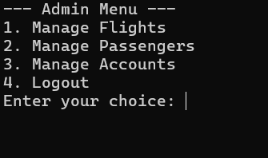
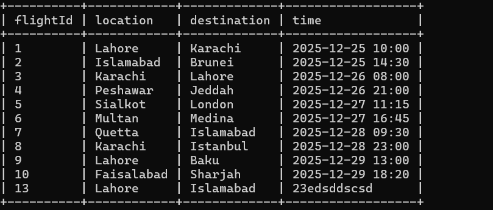

# ✈️ Airport Management System

A robust system developed to **streamline flight scheduling and passenger bookings**, built as part of the **CFP Lab**. This project demonstrates the integration of **core programming logic** with **database management** to create a functional, real-world application.

---

## 🚀 Features

- **Admin Dashboard** – Manage flights, schedules, and passenger data efficiently.  
- **Client Interface** – Seamless ticket booking and management for passengers.  
- **Database Integration** – Powered by **SQLite** for persistent and reliable data storage.  
- **Programming Concepts** – Implemented advanced functions, file handling, and conditional logic.

---

## 👥 Team Members

- **Zohaib Kaleem** – Lead Developer, Database Architecture  
- **Hira Murad** – System Implementation  
- **Maham Tanveer Malik** – Frontend & Booking Logic  

### 🙏 Special Thanks

- **Subhan Amjad** – Lab Engineer, Guidance & Mentorship  
- **Muhammad Umer Riaz** – Lab Engineer, Guidance & Mentorship  

---

## 🛠️ Technologies Used

- `C++`  
- `SQLite`  
- File Handling  
- Functions & Conditional Logic  

---

## 📝 Overview

This project was a **collaborative effort** emphasizing:

- Practical problem-solving  
- Teamwork and communication  
- Software development best practices  

It showcases the integration of **programming logic with database management** to build a **real-world airport management system**.

---

## 📸 Screenshots
- **Home Page**

- **Admin Panel**

- **Client Panel**

- **Flight Schedule**

---
